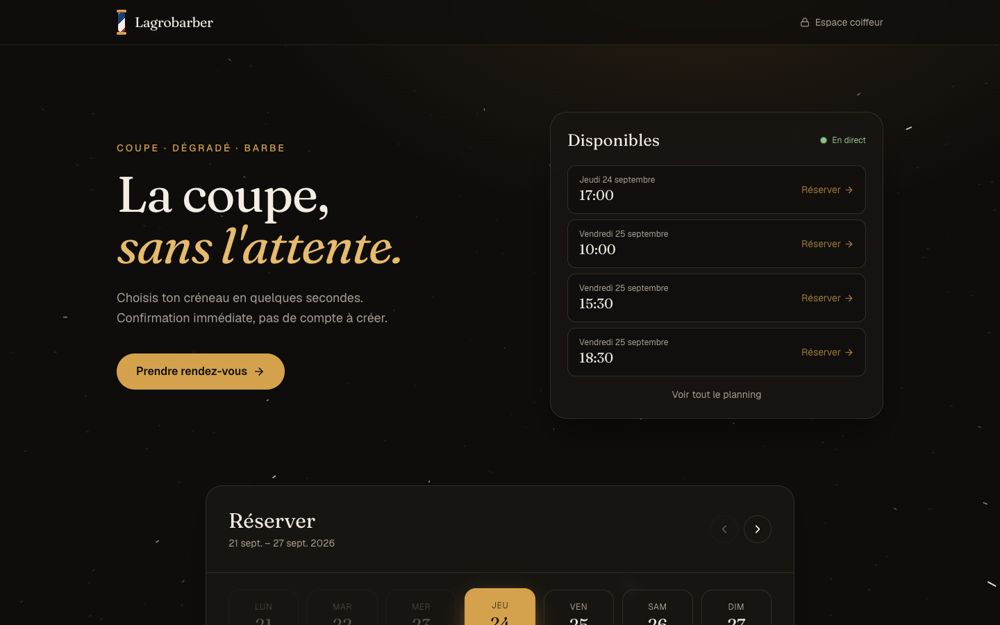
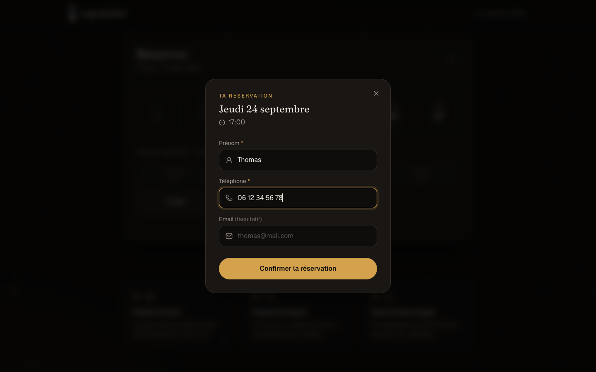
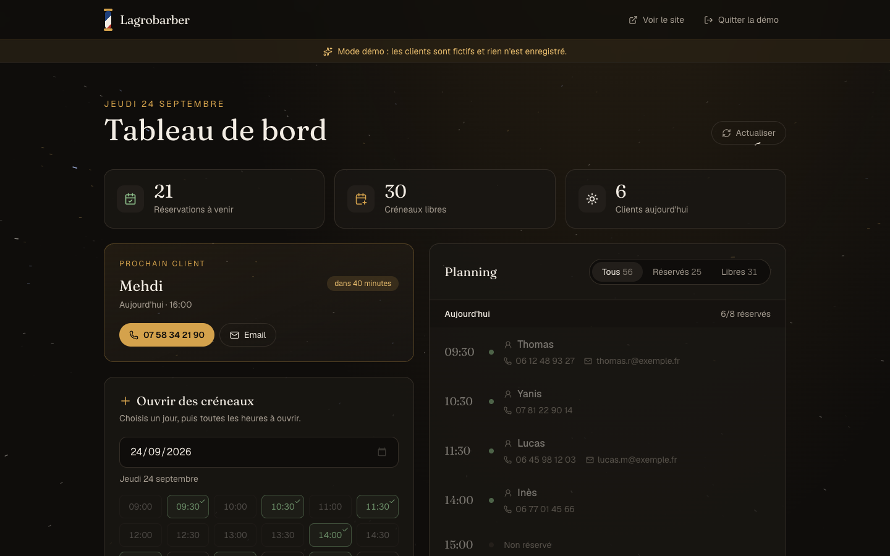
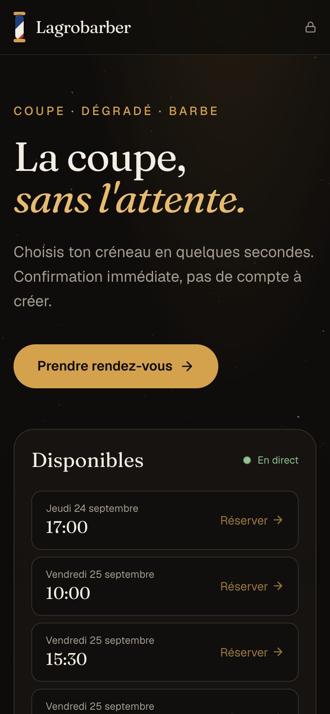

# Lagrobarber

Plateforme de prise de rendez-vous pour un barbier : les clients réservent un créneau en quelques secondes, sans créer de compte, et le coiffeur gère son planning et ses clients depuis un espace privé.

**🔗 [Voir le site](https://barber-rdv-baptiste.vercel.app)** · **✂️ [Essayer l'espace coiffeur (démo)](https://barber-rdv-baptiste.vercel.app/admin?demo)**



## Fonctionnalités

### Côté client
- **Créneaux en direct** : les 4 prochaines places libres sont affichées dès l'arrivée sur le site ; un clic ouvre directement la réservation.
- **Calendrier à la semaine** : navigation par semaine, jours avec des disponibilités signalés, créneaux passés ou déjà pris grisés.
- **Réservation sans compte** : prénom, téléphone et email facultatif, avec validation côté serveur.
- **Responsive** : sur mobile, le formulaire s'ouvre en panneau depuis le bas de l'écran.

### Côté coiffeur (`/admin`)
- **Tableau de bord** : réservations à venir, créneaux libres, clients du jour et fiche du prochain client (appel ou email en un clic).
- **Ouverture de créneaux en lot** : choix d'un jour puis de plusieurs heures d'un coup ; les heures déjà ouvertes sont signalées.
- **Planning** regroupé par jour, filtrable (tous / réservés / libres), suppression en deux clics pour éviter les erreurs.
- **Mode démo** (`/admin?demo`) : le tableau de bord complet avec des clients fictifs, entièrement dans le navigateur, pour découvrir l'outil sans mot de passe et sans toucher aux vraies données.

### Expérience
- Fond animé « voyage dans l'espace » en canvas : le point de fuite suit la souris, le défilement accélère le voyage et les actions importantes déclenchent un effet hyperespace.
- Animations respectueuses du réglage système « réduire les animations ».

| Réservation | Espace coiffeur | Mobile |
|---|---|---|
|  |  |  |

## Stack technique

| | |
|---|---|
| Framework | [Next.js 16](https://nextjs.org) (App Router) · React 19 · TypeScript |
| Style | Tailwind CSS 4 · polices Fraunces et Geist · icônes Lucide |
| Données | PostgreSQL ([Prisma Postgres](https://www.prisma.io/postgres)) · ORM Prisma |
| Hébergement | [Vercel](https://vercel.com) |

## Points techniques

- **Pas de double réservation** : la réservation est une seule requête atomique (`updateMany` conditionné sur `isBooked: false` et une date future). Si deux clients valident le même créneau au même instant, un seul l'obtient ; l'autre reçoit un message clair.
- **Authentification côté serveur** : le mot de passe du coiffeur est vérifié par l'API (comparaison en temps constant) et la session est un cookie `httpOnly` signé en HMAC, avec expiration. Aucune donnée d'authentification n'est exposée au navigateur.
- **Séparation public / privé** : l'API publique (`/api/slots`) est en lecture seule et ne renvoie jamais de données client. Tout ce qui crée, supprime ou affiche des informations personnelles passe par `/api/admin/*`, protégé par la session.
- **Aucun secret dans le dépôt** : la configuration passe par des variables d'environnement (voir [`.env.example`](.env.example)).

### Organisation du code

```
app/
├── page.tsx                  Page client : créneaux en direct, calendrier, réservation
├── admin/
│   ├── page.tsx              Espace coiffeur : connexion, tableau de bord, planning
│   └── demo.ts               Données fictives du mode démo
├── components/
│   ├── Starfield.tsx         Fond animé (canvas)
│   └── ui.tsx                Logo, poteau de barbier, notifications
└── api/
    ├── slots/                GET public : créneaux de la semaine, prochains libres
    ├── book/                 POST public : réservation d'un créneau
    └── admin/
        ├── session/          Connexion / déconnexion du coiffeur
        └── slots/            Créneaux avec données clients, création, suppression
lib/
├── auth.ts                   Vérification du mot de passe et sessions signées
└── prisma.ts                 Client Prisma
prisma/schema.prisma          Modèle de données
```

## Lancer le projet en local

Prérequis : Node.js 20+ et une base PostgreSQL.

```bash
git clone https://github.com/BJ9255/barber-platform.git
cd barber-platform
npm install

cp .env.example .env          # puis renseigne POSTGRES_URL et ADMIN_PASSWORD
npx prisma db push            # crée les tables
npx tsx seed.ts               # facultatif : ajoute des créneaux de test

npm run dev
```

Le site est alors disponible sur [http://localhost:3000](http://localhost:3000) et l'espace coiffeur sur [http://localhost:3000/admin](http://localhost:3000/admin).

## Déploiement

Le site est hébergé sur Vercel et relié à ce dépôt : chaque push sur `main` est déployé automatiquement en production. Le script [`deploy.sh`](deploy.sh) permet aussi de déployer à la main depuis sa machine, après avoir vérifié le code (TypeScript + ESLint).

Les variables `POSTGRES_URL` et `ADMIN_PASSWORD` doivent être configurées dans les paramètres du projet Vercel.
